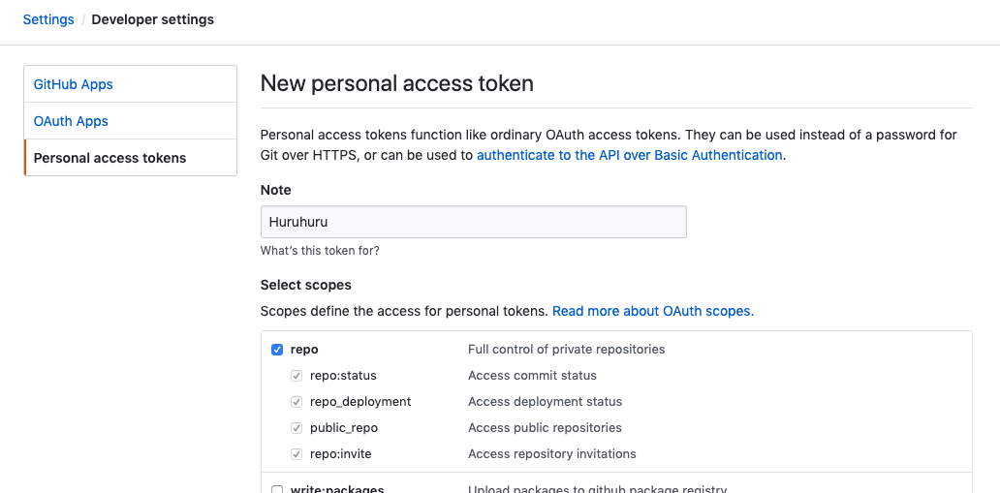

# Huruhuru

Huruhuru is in-app issue reporting debug tool for team QA. supported github only 🙃

## Requirements
- Swift 5.0 or later
- iOS 10.0 or later

Others have not been verified.

## Installation

### [Cocoapods](https://cocoapods.org/)

- insert `pod 'Huruhuru'` to your Podfile.
- run `pod install`

## Usage

1. Create a github token
- check `repo: Full control of private repositories` or `public_repo: Access public repositories`



2. Write to Code.

```swift
// [Example]
// AppDelegate.swift
func application(_ application: UIApplication, didFinishLaunchingWithOptions launchOptions: [UIApplication.LaunchOptionsKey: Any]?) -> Bool {
    // ...
    Huruhuru.shared.start(sendTo: Huruhuru.RepositoryInfo(ownerName: GITHUB_OWNER_NAME, repositoryName: GITHUB_REPOSITORY_NAME) , token: Huruhuru.GithubToken(token: GITHUB_TOKEN), supportDetectGesture: Huruhuru.SupportDetectGesture(types: [.shake, .screenshot]) )
    // ...
}
```

note: By using [cocoapods-keys](https://github.com/orta/cocoapods-keys), you do not have to commit SecretKey directly to the source code.
