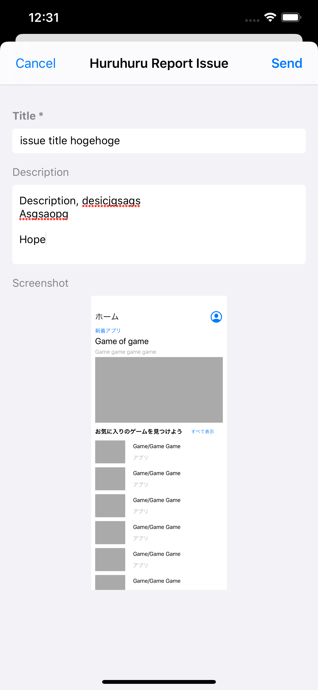
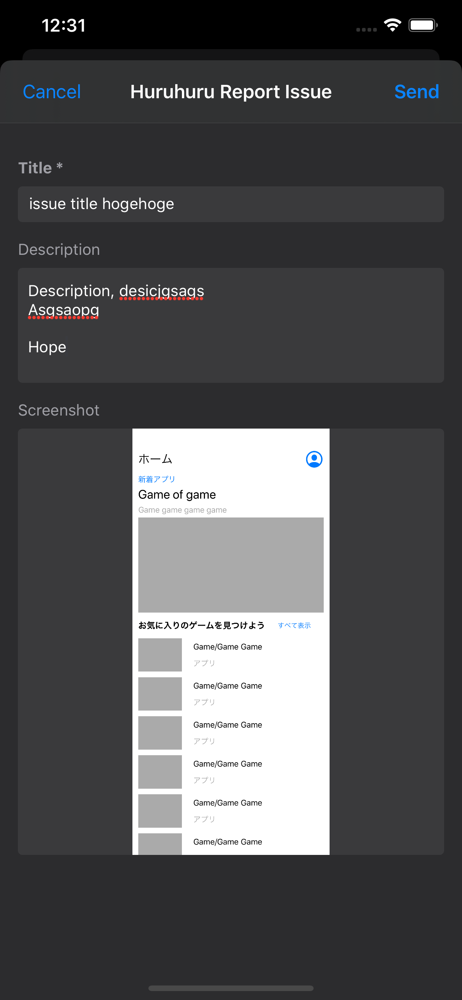

# Huruhuru

[](LICENSE)
[](http://cocoadocs.org/docsets/Huruhuru)
[](http://cocoadocs.org/docsets/Huruhuru)


Huruhuru is in-app issue reporting debug tool for team QA. supported github only 🙃

## Requirements
- Swift 5.0 or later
- iOS 10.0 or later

Others have not been verified.

## TODO
- [ ] Add Tests
- [ ] Support Carthage

## ⚠ Warning

- `Huruhuru` automatically creates an image storage branch (`huruhuru-auto-created-branch-for-upload-image`) in your specified repository.

## Installation

### [Cocoapods](https://cocoapods.org/)

- insert `pod 'Huruhuru', :configurations => ['YOUR_DEBUG_SCHEME']` to your Podfile.
- run `pod install`

## Usage

1. Create a github token
- access to [generate github token page](https://github.com/settings/tokens)
- check `repo: Full control of private repositories` or `public_repo: Access public repositories`


2. Write to Code.

```swift
// [Example]
// AppDelegate.swift
func application(_ application: UIApplication, didFinishLaunchingWithOptions launchOptions: [UIApplication.LaunchOptionsKey: Any]?) -> Bool {
    // ...
    Huruhuru.shared.start(sendTo: Huruhuru.RepositoryInfo(ownerName: GITHUB_OWNER_NAME, repositoryName: GITHUB_REPOSITORY_NAME) , token: Huruhuru.GithubToken(token: GITHUB_TOKEN), supportDetectGesture: Huruhuru.SupportDetectGesture(types: [.shake, .screenshot]) )
    // ...
}
```

note: By using [cocoapods-keys](https://github.com/orta/cocoapods-keys), you do not have to commit SecretKey directly to the source code.

3. Take a shake gesture or take a screenshot to open the report view

light | dark
-- | --
 | 

